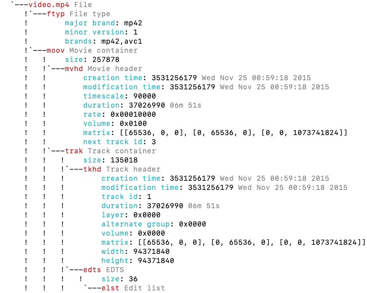
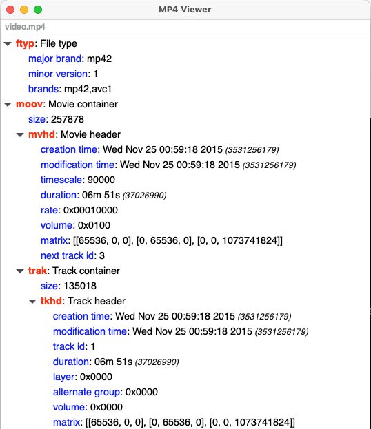

MP4Viewer
=========

MP4Viewer is an ISO base media file format viewer.
You can use it to view the metadata of an isobmff file on the console or a new window, or save it as a json file.
The definitions of structures used in the code can be found in the ~publicly available standard~ (it is not free to download anymore) [ISO/IEC 14496-12 - ISO base media file format](http://standards.iso.org/ittf/PubliclyAvailableStandards/index.html)

## Basic usage

```bash
./parse.sh [-h] [-o {stdout,gui,json}] [-e] [-c {on,off}] file.mp4
```

## Supported flags

```
usage: mp4viewer.py [-h] [-o {stdout,gui,json}] [-c {on,off}] [-j JSON_PATH] [-e] [--debug] [--latex] input_file

Parse mp4 files (ISO bmff) and view the boxes and their contents. The output can be viewed on the console, a window, or saved in to a json file.

positional arguments:
  input_file            Location of the ISO bmff file (mp4)

options:
  -h, --help            show this help message and exit
  -o {stdout,gui,json}, --output {stdout,gui,json}
                        Specify the output format. Please note that pygtk is required for `gui`.
  -c {on,off}, --color {on,off}
                        Toggle colors in console based output; on by default.
  -j JSON_PATH, --json JSON_PATH
                        Path to the json file where the output should be saved. If this is specified, the json output will be generated and written to this file even if the requested output format is not
                        json. If the output format is json and this argument is not specified, the json object will be written to the current directory using "$PWD/$(basename input_file).mp4viewer.json"
  -e, --expand-arrays   Do not truncate long arrays
  --debug               Used for internal debugging
  --latex               Generate latex-in-markdown for github README
```

## Sample outputs:
### The default output on the console


### GTK


MP4Viewer uses gtk in graphics mode and requires pygtk3 for viewing results in a window.
This usually comes preinstalled with recent versions of ubuntu.


You can find more similar [MP4 tools in this page](https://github.com/video-dev/community-knowledge-base/blob/master/list-of-iso-bmff-mp4-tools.md)
